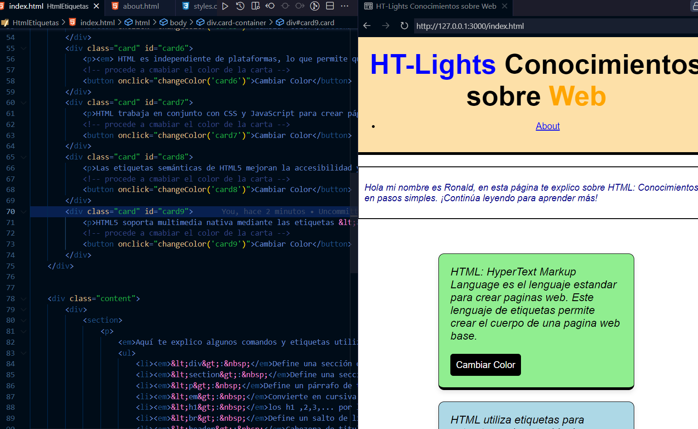
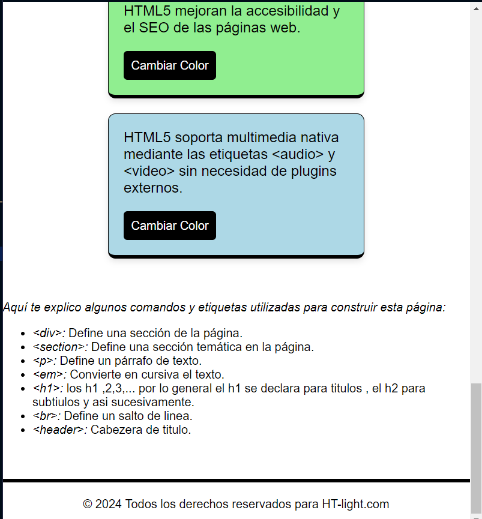

# Html-Activity
# HTML y CSS Conceptos de aprendizaje Basicos

En este repositorio se encuentra información y ejemplos sobre HTML y CSS Demo.

## Contenido del Repositorio

- `index.html`: Archivo principal HTML con ejemplos básicos de HTML y CSS.
- `styles.css`: Archivo CSS con estilos para el archivo HTML.
- `about.html`: Página "Acerca de" con información sobre este proyecto.
- `res/`: Carpeta que contiene las imágenes utilizadas en la documentación.

## Ejemplos de HTML y CSS

Repo de Contenido: incluye ejemplos básicos de HTML y CSS que cubren los siguientes temas:

- Estructura básica de HTML
- Uso de etiquetas HTML como `
`, `
`, `<h1>`, etc.
- Aplicación de estilos CSS básicos como color de fondo, tamaño de fuente, márgenes, etc.

## Imágenes

Aquí hay algunas imágenes del proyecto:

## Etiquetas

Este proyecto cubre las siguientes tecnologías y herramientas:

- 
- 
- 
- 
